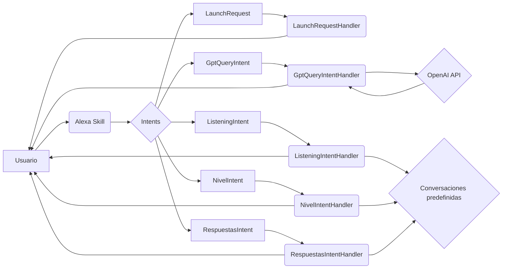

## 📄 Descripción general del proyecto

*   **Nombre del código:** Tutor de Idiomas
*   **Versión:** 1.0
*   **Explicación general:** Este código implementa una skill de Alexa para la práctica de idiomas, permitiendo a los usuarios interactuar en inglés o español. La skill utiliza la API de OpenAI para generar respuestas y mantener conversaciones fluidas. Además, ofrece ejercicios de escucha interactivos con diferentes niveles de dificultad.
*   **Qué problema resuelve el código:** Facilita el aprendizaje y la práctica de idiomas a través de conversaciones interactivas y ejercicios de escucha, adaptándose al nivel y preferencias del usuario.

## ⚙️ Visión general del sistema

*   **Arquitectura del sistema:**



*   **Tecnologías utilizadas:**
    *   Python
    *   Alexa Skills Kit SDK for Python
    *   OpenAI API
    *   boto3 (AWS SDK for Python)
*   **Dependencias:**
    *   ask-sdk-core
    *   ask-sdk-model
    *   openai
    *   json
    *   unicodedata
    *   requests
    *   boto3
    *   uuid
    *   datetime
*   **Requisitos del sistema:**
    *   Cuenta de Amazon Developer para crear la skill de Alexa.
    *   Cuenta de OpenAI con una API key válida.
    *   Cuenta de AWS con permisos para acceder a DynamoDB.
    *   Python 3.6 o superior.
*   **Prerrequisitos:**
    *   Tener instaladas las dependencias de Python listadas.
    *   Configurar las credenciales de AWS y OpenAI.
    *   Crear una tabla en DynamoDB con el nombre especificado en el código.

## 📦 Guía de uso

*   **Cómo usarlo:**
    1.  Invoca la skill de Alexa diciendo "Abrir Tutor de Idiomas".
    2.  La skill te preguntará qué tema te gustaría discutir para practicar tus habilidades de conversación.
    3.  Puedes responder en español o inglés, y la skill te responderá en el mismo idioma.
    4.  Para practicar la escucha, di "Practicar escucha".
    5.  La skill te preguntará en qué nivel te gustaría empezar: fácil, medio o difícil.
    6.  Responde a las preguntas eligiendo la opción correcta (opción a, opción b, opción c, u opción d).
*   **Explicación de los pasos (entrada, salida, parámetros):**
    *   **Entrada:** Comandos de voz del usuario a través de Alexa.
    *   **Salida:** Respuestas de voz generadas por la skill de Alexa.
    *   **Parámetros:**
        *   `query` (en `GptQueryIntent`): La frase o pregunta del usuario para iniciar una conversación.
        *   `nivel` (en `NivelIntent`): El nivel de dificultad seleccionado por el usuario (fácil, medio, difícil).
        *   `opcion` (en `RespuestasIntent`): La opción elegida por el usuario como respuesta a una pregunta.
*   **Caso de uso de ejemplo:**

```python
# Ejemplo de uso de la skill para practicar la escucha en nivel fácil
# Asumiendo que el usuario ya ha invocado la skill y dicho "Practicar escucha"

# Simulación de la respuesta del usuario al elegir el nivel
nivel_elegido = "fácil"

# Simulación de la lógica dentro de NivelIntentHandler
if "facil" in nivel_elegido:
    conversacion_actual = conversacion_ff # Asumiendo que conversacion_ff es la conversación para nivel fácil
    indice_pregunta = 0 # Inicializar el índice de la pregunta

    # Simulación de la primera pregunta
    pregunta = conversacion_actual[indice_pregunta][0]
    print(f"Alexa: {pregunta}")

    # Simulación de la respuesta del usuario
    respuesta_usuario = "opcion a"

    # Simulación de la lógica dentro de RespuestasIntentHandler
    respuesta_esperada = conversacion_actual[indice_pregunta][1]

    if "a" in respuesta_usuario: # Simplificación para el ejemplo
        if respuesta_usuario == respuesta_esperada:
            print("Alexa: ¡Correcto!")
        else:
            print("Alexa: Incorrecto.")
```

## 🔐 Documentación de la API

*   **Endpoints:** No aplica, ya que es una skill de Alexa y no expone endpoints HTTP.
*   **Formatos de solicitud y respuesta:** No aplica, ya que la interacción es a través de voz.
*   **Autenticación y autorización:** La autenticación se maneja a través de la plataforma de Amazon Alexa y la autorización a través de los permisos concedidos a la skill.

## 📚 Referencias

*   [Alexa Skills Kit SDK for Python](https://developer.amazon.com/en-US/docs/alexa/alexa-skills-kit-sdk-for-python/overview.html)
*   [OpenAI API](https://platform.openai.com/docs/api-reference)
*   [boto3 - AWS SDK for Python](https://boto3.amazonaws.com/v1/documentation/api/index.html)
*   [DynamoDB](https://aws.amazon.com/dynamodb/)
*   [UUID](https://docs.python.org/3/library/uuid.html)
*   [Datetime](https://docs.python.org/3/library/datetime.html)
