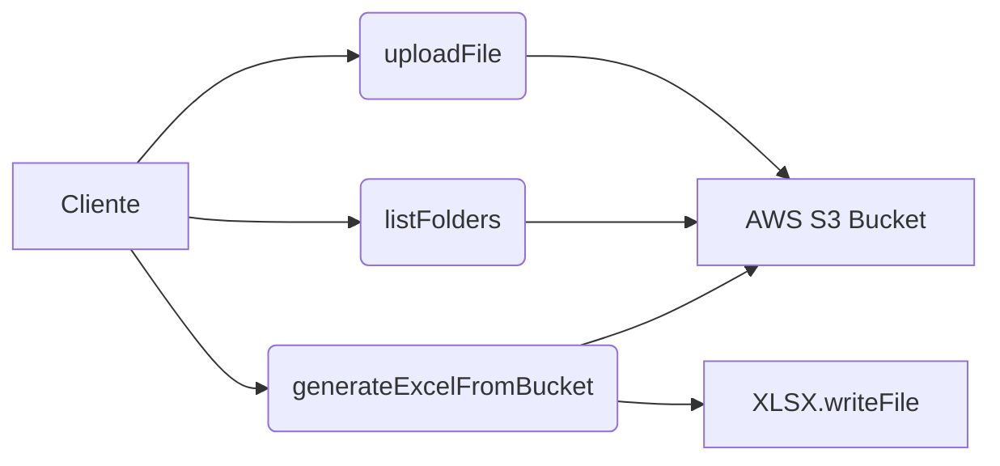

## 📄 Descripción general del proyecto

- **Nombre del código:** AWS S3 File Manager
- **Versión:** 1.0
- **Explicación general:** Este código proporciona funciones para interactuar con AWS S3, incluyendo la carga de archivos, el listado de objetos dentro de un bucket, la generación de un archivo Excel con la lista de archivos y carpetas, y el listado de carpetas dentro de un bucket.
- **Qué problema resuelve el código:** Facilita la gestión de archivos en AWS S3, permitiendo a los usuarios cargar, listar y organizar archivos de manera eficiente, así como generar informes en formato Excel.

## ⚙️ Visión general del sistema

- **Arquitectura del sistema:**



- **Tecnologías utilizadas:**
  - AWS SDK for JavaScript
  - xlsx (js-xlsx)
- **Dependencias:**
  - `aws-sdk`: Para la interacción con AWS S3.
  - `xlsx`: Para la generación de archivos Excel.
- **Requisitos del sistema:**
  - Node.js
  - Cuenta de AWS con permisos para acceder a S3.
- **Prerrequisitos:**
  - Configuración de las variables de entorno `NEXT_PUBLIC_AWS_ACCESS_KEY_ID`, `NEXT_PUBLIC_AWS_SECRET_ACCESS_KEY` y `NEXT_PUBLIC_AWS_REGION` con las credenciales de AWS.
  - Instalación de las dependencias: `npm install aws-sdk xlsx`

## 📦 Guía de uso

- **Cómo usarlo:** El código proporciona funciones para interactuar con AWS S3. Para utilizar estas funciones, debes importarlas en tu proyecto y llamarlas con los parámetros adecuados.
- **Explicación de los pasos:**
  1. **`uploadFile(file, folderName)`:**
     - **Entrada:**
       - `file`: Objeto `File` que se va a cargar.
       - `folderName` (opcional): Nombre de la carpeta en S3 donde se guardará el archivo. Por defecto, es "IDEMITSU".
     - **Salida:** URL del archivo cargado en S3.
     - **Parámetros:**
       - `Bucket`: Nombre del bucket de S3 (fijo: "refaccionesdotcom").
       - `Key`: Ruta del archivo en S3, incluyendo el nombre del archivo.
       - `Body`: Contenido del archivo.
       - `ContentType`: Tipo de contenido del archivo.
  2. **`generateExcelFromBucket(bucketName, folderPrefix)`:**
     - **Entrada:**
       - `bucketName`: Nombre del bucket de S3.
       - `folderPrefix`: Prefijo de la carpeta en S3.
     - **Salida:** Genera un archivo Excel localmente llamado `$images.xlsx` con la lista de archivos y sus URLs.
     - **Parámetros:**
       - `Bucket`: Nombre del bucket de S3.
       - `Prefix`: Prefijo de la carpeta para filtrar los objetos.
  3. **`listFolders()`:**
     - **Entrada:** Ninguna.
     - **Salida:** Un array de strings, donde cada string representa una carpeta y la cantidad de archivos que contiene.
     - **Parámetros:**
       - `Bucket`: Nombre del bucket de S3 (fijo: "refaccionesdotcom").
       - `Delimiter`: Delimitador para listar carpetas (fijo: "/").
- **Caso de uso de ejemplo:**

```javascript
import { uploadFile } from './s3-file-manager';

async function uploadAndLog(file) {
  try {
    const fileUrl = await uploadFile(file, 'my-folder');
    console.log('File uploaded to:', fileUrl);
  } catch (error) {
    console.error('Failed to upload file:', error);
  }
}

// Supongamos que 'myFile' es un objeto File obtenido de un input de tipo file
// uploadAndLog(myFile);
```

## 🔐 Documentación de la API

- **Endpoints:** No aplica, ya que no es una API REST. Son funciones que interactúan directamente con AWS S3.
- **Formatos de solicitud y respuesta:** No aplica.
- **Autenticación y autorización:** La autenticación y autorización se manejan a través de las credenciales de AWS configuradas en las variables de entorno (`NEXT_PUBLIC_AWS_ACCESS_KEY_ID`, `NEXT_PUBLIC_AWS_SECRET_ACCESS_KEY` y `NEXT_PUBLIC_AWS_REGION`).  Estas credenciales deben tener los permisos necesarios para realizar las operaciones en el bucket de S3 especificado.

## 📚 Referencias

- **AWS SDK for JavaScript:** [https://aws.amazon.com/sdk-for-javascript/](https://aws.amazon.com/sdk-for-javascript/)
- **AWS S3 Documentation:** [https://docs.aws.amazon.com/s3/](https://docs.aws.amazon.com/s3/)
- **js-xlsx (SheetJS):** [https://sheetjs.com/](https://sheetjs.com/)
- **Variables de entorno en Node.js:** [https://nodejs.org/en/learn/getting-started/introduction-to-nodejs](https://nodejs.org/en/learn/getting-started/introduction-to-nodejs)
